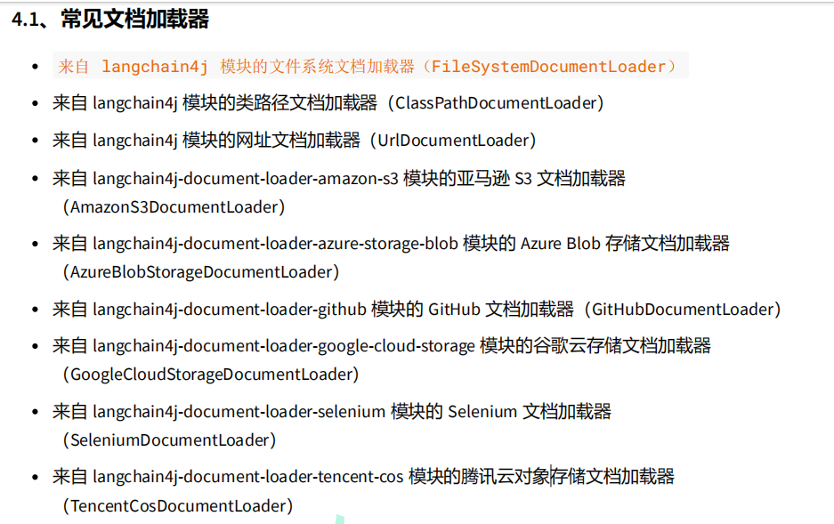
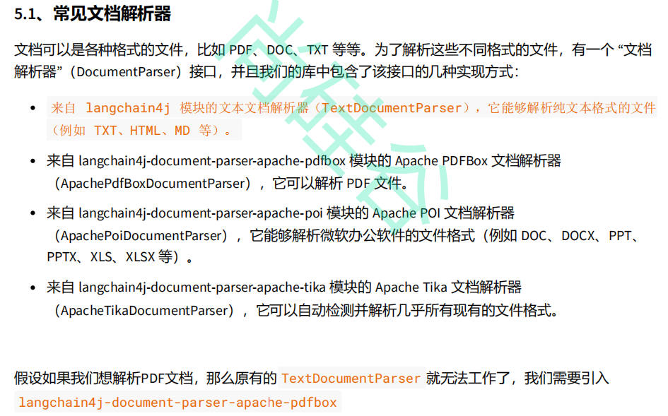
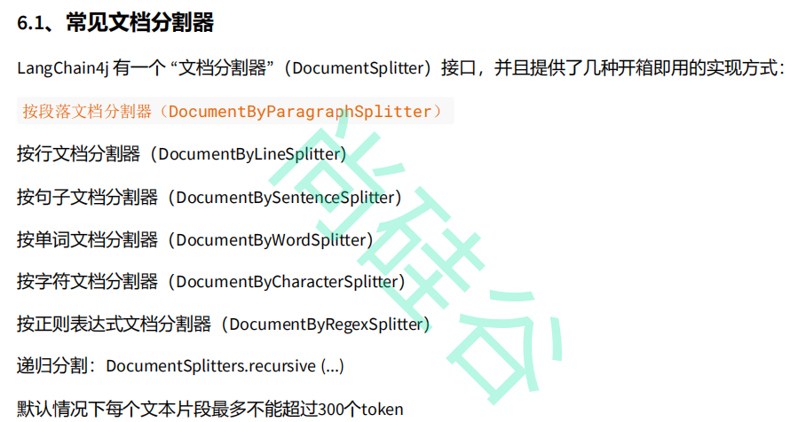

# 第一部分
# P01-P15 建立工程，接入模型

# 第二部分
# P16 AIService 代理完成 assistant.chat("prompt") 
   AIService工作原理：AiServices会组装Assistant接口以及其他组件，并使用反射机制创建一个实现Assistant的代理对象，这个代理对象会处理输入输出的所有转换工作。
   在这个例子中，chat方法的输入是一个字符串，但是大模型需要一个UserMessage对象。所以，代理对象将这个字符串转换为UserMessage,并调用聊天语言程序。
   chat方法的输出类型也是字符串，但是大模型返回的是AiMessage对象，代理对象会将其转换为字符串
   _简单理解是：代理对象是完成输入输出的转换，对于LLMs来说输入输出的数据类型是UserMessage，而面向用户层是字符串_

# 第三部分
# P20 聊天记忆ChatMemory    **MessageWindowChatMemory**
  
  ```
  // 设置缓存的轮次 最大记忆数量
  MessageWindowChatMemory chatMemory = MessageWindowChatMemory.withMaxMessages(10); 

  Assistant assistant = AiServices.builder(Assistant.class)
                                   .chatLanguageModel(qwenChatModel)
                                   .chatMemory(chatMemory) //这样建立的assistant具有聊天记忆
                                   .build();
  ```

  **利用注解，注入AIService时自带chatMemory**
  ``` 
     @AiService(
             wiringMode = EXPLICIT,
             chatModel = "qwenChatModel",
             chatMemory = "chatMemory"
     )
     public interface MemoryChatAssistant {
         String chat(String message);
     }
     
     chatMemory是在config里面自定义的bean对象
     @Configuration
    public class MemoryChatAssistantConfig {
    @Bean
    public ChatMemory chatMemory(){
        return MessageWindowChatMemory.withMaxMessages(10);
    }
}
  ```

# P23 隔离聊天记忆 @memoryId隔离记忆的标识  @userMessage用户发过来的会话信息
_定制assistant_
```
   @AiService(
   wiringMode = EXPLICIT,
   chatModel = "qwenChatModel",
   **chatMemoryProvider = "chatMemoryProvider"**
   )
   public interface SeparateChatAssistant {
   **String chat(@MemoryId String memoryId,@UserMessage String userMessage);**
   }
```
_定制chatMemoryProvider_
```
   @Configuration
   public class chatMemoryProviderConfig {
   
       @Bean
       public ChatMemoryProvider chatMemoryProvider(){
           return memoryId -> MessageWindowChatMemory.builder()
                   .id(memoryId)
                   .maxMessages(10)
                   .build();
       }
   }
```
_使用chatMemoryProvider_
```
private SeparateChatAssistant separateChatAssistant;

    @Test
    public void testChatMemory5() {

        String answer1 = separateChatAssistant.chat("1","我现在叫张三");
        System.out.println(answer1);
        String answer2 = separateChatAssistant.chat("1","我叫什么");
        System.out.println(answer2);

        String answer3 = separateChatAssistant.chat("2","我叫什么");
        System.out.println(answer3);

    }
}
```

# 第四部分
# P26 持久化聊天记忆 Persistence
 ## 存储介质 MongoDB是一个基于文档的NoSQL(非关系数据库)
   - MongoDB使用集合来组织文档，每个文档都是有键值对组成的
   - 集合类似于表，文档类似与传统数据库的每一行

 ## @Component
   - 组件扫描标记：将被注解的类标识为 Spring 容器管理的组件
   - 自动装配：配合 @Autowired 注解实现依赖注入
   - IoC 容器管理：让 Spring 容器能够创建和管理该类的实例
 
 ## @Bean注册一个Bean实例  @AiService中通过设置同名bean获取同名bean的返回值
   ```
   @Bean // 为chatMemoryProvider注册一个Bean实例 别人拿到这个Bean实例可以获取其返回值的内容
    public ChatMemoryProvider chatMemoryProvider(){
        return memoryId -> MessageWindowChatMemory
                .builder()
                .id(memoryId)
                .maxMessages(10)
                //.chatMemoryStore(new InMemoryChatMemoryStore()) // 聊天记忆以键值对的形式存储在内存中 持久化聊天记忆
                .chatMemoryStore(mongoChatMemoryStore)
                .build();
    }
   ```
   ```
         @AiService(
              wiringMode = EXPLICIT,
              chatModel = "qwenChatModel",
              chatMemoryProvider = "chatMemoryProvider"
      )
      public interface SeparateChatAssistant {
          String chat(@MemoryId String memoryId,@UserMessage String userMessage);
      }
   ```
 ##  @Bean基本原理
  - _依赖建立_ 1.Spring 容器注册：@Bean 注解的方法会在 **Spring 容器启动时执行**，并将其**返回值**注册为 **Bean 实例**
              2.**方法名(chatMemoryProvider)作为 Bean ID**：默认情况下，@Bean 方法名（这里是 chatMemoryProvider）成为 Bean 的唯一标识符
  - _关联过程_ @AiService 注解中的 chatMemoryProvider = "chatMemoryProvider" 指定要使用的 Bean 名称 
  - _配置生效流程_ Spring 扫描 @Configuration 类并识别 @Bean 方法,执行 chatMemoryProvider() 方法创建 ChatMemoryProvider 实例

 ## @AiService 注解的核心功能
  ```
   @AiService(
        wiringMode = EXPLICIT,
        chatModel = "qwenChatModel",
        chatMemoryProvider = "chatMemoryProvider"
)
  ```
  - _动态代理生成_：Spring 启动时，LangChain4j 会为 SeparateChatAssistant 接口创建一个**动态代理实现类**
  - _AI 服务封装_：注解参数配置了 AI 服务的各个组件，包括**模型**和**记忆提供者**
  - 具体执行步骤
          1.方法调用：当调用 chat() 方法时
          2.记忆管理：根据传入的 memoryId 从 **chatMemoryProvider 获取对应的记忆存储**
          3.消息处理：将 userMessage 发送给 qwenChatModel 处理
          4.上下文维护：利用记忆提供者维护对话历史（最多10条消息）
 ## 核心最智能的地方
   ```
   @Autowired
    private MongoChatMemoryStore mongoChatMemoryStore;
    @Bean
    public ChatMemoryProvider chatMemoryProvider(){
        return memoryId -> MessageWindowChatMemory
                .builder()
                .id(memoryId)
                .maxMessages(10)
                //.chatMemoryStore(new InMemoryChatMemoryStore()) // 聊天记忆以键值对的形式存储在内存中 持久化聊天记忆
                .chatMemoryStore(mongoChatMemoryStore)
                .build();
    }
   ```
   **MessageWindowChatMemory**
    - 新消息到达：将用户消息和AI回复添加到记忆队列
    - 容量检查：如果消息总数超过10条，移除最老的消息
    - 上下文构建：为AI模型提供最近10条消息作为上下文
    - 持久化存储：通过 MongoChatMemoryStore 将记忆数据保存到MongoDB

 # 第五部分
 # P32 Prompt
  - 系统提示词注解 @SystemMessage
  - 用户提示词注解 @UserMessage: 就是每次都会随着用户输入一起带到模型中的
  - 参数注解 @V:
   ```
    @UserMessage("你是一个语音助手，请用湖南临湘话回答我。今天是{{current_date}}。{{message}}")
    String chat(@V("message") String message);
   ```
  - @UserMessage @V 实现多参数
  - @SystemMessage @V

# 第六部分
# P49 RAG VS 大模型微调
 - _文档加载器_  默认包含的文档解析器只能解析纯文本文件  
     Document document = FileSystemDocumentLoader.loadDocument("E:/knowledge/测试.txt"); 
 - 
 - _文档解析器_
 - 
 - _文档分割器_
 -  
 - _向量转换和向量存储_

**RAG全流程**

                    原始数据
                    ↓
                    数据清洗
                    ↓
                    文档切分
                    ↓
                    向量化
                    ↓
                    向量数据库
                    ↑
用户问题 → 向量化 → 相似度检索
                    ↓
                    重排序
                    ↓
                    Prompt构建
                    ↓
                    大模型
                    ↓
                    输出答案